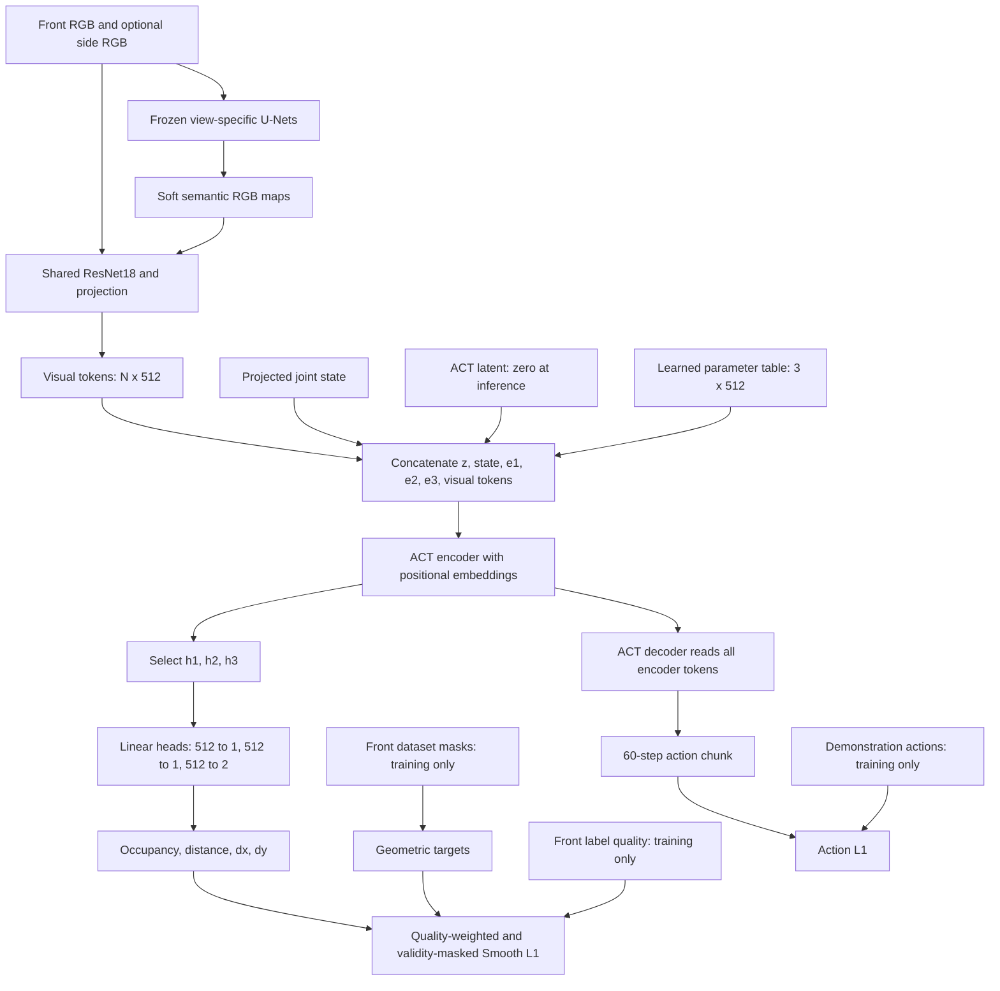

# QToken-ACT: Implementation Notes

The current experiments are UNET-SEM-V5-F-QTOKEN and UNET-SEM-V5-FS-QTOKEN.
The generated bitmap in figures/qtoken_act_concept.png is a conceptual illustration;
the directed graph below specifies the exact data dependencies. In particular, RGB and
semantic features both enter the encoder sequence, and the tool endpoint is distinct
from the object centroid.

Each initial query embedding is shared across samples. Its encoder output depends on
the current observation. The parameter table contains 1536 numbers; the output heads
and expanded positional embeddings introduce additional parameters. The three tokens
are encoder self-attention participants, not dedicated DETR decoder queries. All tokens
produce attention Q/K/V projections; the term Query Token refers to their assigned role.

Targets: visible object area / image area; object-region centroid distance / image
diagonal; normalized displacement from the x-left endpoint of the PCA-fitted tool line
to the object centroid. The current implementation fits the PCA line in width/height
normalized coordinates. Output widths are [1,1,2]. Occupancy zero remains supervised;
relations involving absent masks are excluded from the auxiliary loss. Pair quality uses
the minimum of the two class quality weights. Smooth L1 beta is 0.01, with mean reduction
within each token group and then across three groups. Total loss adds the geometry loss
(weight 1 by default) to ACT action L1 plus weighted KL.

Action and geometric losses update ACT; the U-Nets stay frozen. At inference, geometric
predictions are not fed back as scalar inputs. Encoder hidden states influence the action
decoder. There is no attention-map supervision, visibility gate, or completion controller.
Training-time geometric regression is not evidence that action inference causally uses it.
Evaluate predictions with model.eval(), without demonstration-conditioned VAE latents,
and compare token interventions and real-robot outcomes on matched trials.

## References

- ViT, An Image is Worth 16x16 Words (ICLR 2021):
  https://arxiv.org/abs/2010.11929
  Learnable classification token concatenated into an encoder with an output prediction head.
- DETR, End-to-End Object Detection with Transformers (ECCV 2020):
  https://arxiv.org/abs/2005.12872
  Learned object queries trained by prediction losses. Its decoder and matching-based
  object assignment differ from our fixed-semantics encoder tokens.
- ACT, Learning Fine-Grained Bimanual Manipulation with Low-Cost Hardware (RSS 2023):
  https://arxiv.org/abs/2304.13705
  The action-chunk policy backbone, not a source for the three geometry-supervised tokens.

## Figure Provenance

Generated with built-in imagegen, then inspected and revised. Prompt specification:
Chinese white-background scientific diagram of frozen per-view U-Net semantics and RGB
through shared ResNet18; concatenate visual tokens, state, latent and three learned
512-dimensional vectors; encoder outputs branch to ACT decoder and [1,1,2] geometry heads;
front labels and quality enter only training losses. Distinguish hidden-feature conditioning
from numeric feedback. The image is conceptual; use the Mermaid graph for exact wiring.
